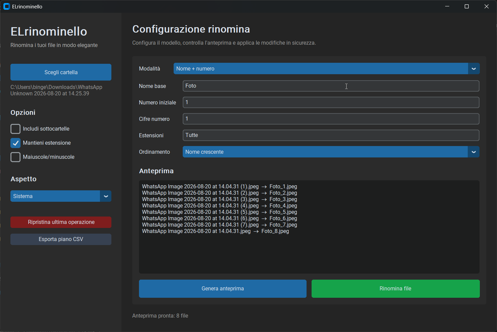

# ELrinominello

ELrinominello è un'applicazione desktop Python per rinominare in modo semplice e sicuro molti file contemporaneamente. Include un'interfaccia grafica moderna, anteprima delle modifiche, filtri, ordinamento, ripristino dell'ultima operazione ed esportazione del piano in CSV.

## Anteprima dell'applicazione




## Repository

[ELPythonEMI/ELrinominello](https://github.com/ELPythonEMI/ELrinominello)

## Funzionalità

- Selezione di una cartella tramite interfaccia grafica.
- Supporto opzionale per le sottocartelle.
- Anteprima nome originale → nuovo nome.
- Modalità Nome + numero.
- Modalità Nome + data.
- Modalità Nome + data + numero.
- Prefisso + nome originale.
- Sostituzione di testo nel nome.
- Modello personalizzato con `{num}`, `{date}`, `{orig}` e `{name}`.
- Numero iniziale configurabile.
- Zeri iniziali configurabili.
- Data di modifica, data di creazione o data odierna.
- Formato data configurabile tramite i codici Python `strftime`.
- Filtro per estensioni, ad esempio `jpg,png,pdf`.
- Ordinamento per nome, data o dimensione.
- Gestione automatica dei nomi duplicati.
- Conservazione o rimozione dell'estensione.
- Ripristino dell'ultima rinomina.
- Esportazione dell'anteprima in CSV.
- Tema chiaro, scuro o sistema.
- Normalizzazione dei nomi per ridurre i caratteri problematici.

## Requisiti

- Python 3.9 o superiore.
- Windows, macOS o Linux.
- Tkinter, normalmente incluso nelle installazioni standard di Python.
- CustomTkinter.

## Installazione

Clona il repository e accedi alla cartella del progetto:

```bash
git clone https://github.com/ELPythonEMI/ELrinominello.git
cd ELrinominello
```

Installa la dipendenza grafica:

```bash
python -m pip install --upgrade pip
python -m pip install customtkinter
```

Su alcuni sistemi il comando può essere `python3` invece di `python`.

## Avvio

```bash
python ELrinominello.py
```

## Utilizzo rapido

1. Avvia l'applicazione.
2. Premi **Scegli cartella**.
3. Seleziona la modalità di rinomina.
4. Configura nome, data, numerazione o modello.
5. Controlla l'anteprima.
6. Premi **Rinomina file** e conferma.

## Modelli personalizzati

Nella modalità **Sequenza personalizzata** puoi usare questi segnaposto:

| Segnaposto | Significato |
|---|---|
| `{num}` | Numero progressivo formattato con gli zeri iniziali. |
| `{date}` | Data secondo il formato configurato. |
| `{orig}` | Nome originale senza estensione. |
| `{name}` | Alias di `{orig}`. |

Esempio:

```text
Foto_{date}_{num}_{orig}
```

Può produrre nomi come:

```text
Foto_2026-08-20_001_immagine.jpg
```

## Formati data

Il campo del formato data usa la sintassi Python `strftime`.

| Formato | Esempio |
|---|---|
| `%Y-%m-%d` | `2026-08-20` |
| `%d-%m-%Y` | `20-08-2026` |
| `%Y%m%d` | `20260820` |
| `%d_%m_%Y` | `20_08_2026` |

## Filtri e ordinamento

Per limitare la rinomina a determinate estensioni, inserisci nel campo **Estensioni** una lista separata da virgole:

```text
jpg,jpeg,png
```

Lascia `Tutte` per includere ogni estensione.

## Sicurezza

L'applicazione mostra sempre un'anteprima prima della modifica. Durante la rinomina usa nomi temporanei per ridurre i conflitti tra file e gestisce automaticamente i duplicati aggiungendo un suffisso numerico.

È comunque consigliabile lavorare su una copia dei dati importanti. Il ripristino disponibile riguarda l'ultima operazione eseguita durante la sessione corrente.


## `.gitignore` consigliato

```gitignore
__pycache__/
*.py[cod]
*$py.class
.venv/
venv/
env/
.vscode/
.idea/
.DS_Store
Thumbs.db
```

## Creazione di un eseguibile Windows

Installa PyInstaller:

```bash
python -m pip install pyinstaller
```

Crea l'eseguibile senza console:

```bash
pyinstaller --onefile --windowed --name ELrinominello ELrinominello.py
```

Il risultato sarà nella cartella `dist`.


## Licenza

MIT — libero per uso personale e commerciale.

## Autore

Sviluppato da [ELPythonEMI](https://github.com/ELPythonEMI).
